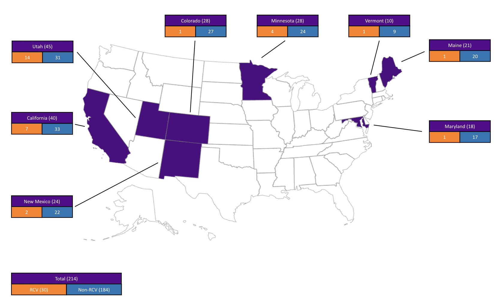

# Using Voter File Data to Study Electoral Reform
This is a group capstone project completed for the MS in Data Science program at NYU. Group members are:
* Carolyn Kolaczyk
* Doma Ghale [@dg2491](https://github.com/dg2491)
* Jin Ishizuka [@jnshzk](https://github.com/jnshzk)
* Rodrigo Kreis de Paula [@rodrigokreis](https://github.com/rodrigokreis)

The goal of this project is to use voter file data consisting of nearly 190 million records to learn about how electoral reform affects participation in U.S. cities. This will involve wrangling and mining large datasets to uncover patterns in the demographic features associated with voter turnout across cities with and without ranked-choice-voting (RCV). We also develop predictive models to forecast the likely effects of RCV adoption on the turnout for different subgroups of voters.

## Data
Our voter-level data comes from the [L2 Political Academic Voter File](https://l2-data.com/datamapping/), which is a continuously updated database of registered voters in the US. It contains two types of files: Demographic and Vote History. The demographic file consists of 691 detailed socio-demographic variables for each voter. The vote history file contains information on which elections each voter has voted in since 1994.

We also use additional city-level [census data](https://simplemaps.com/data/us-cities). 

## Data Processing
We sample cities from eight states which have implemented ranked-choice-voting: 
* California
* Colorado
* Maine
* Maryland
* Minnesota
* New Mexico
* Utah
* Vermont

In order to obtain a sample of demographically similar RCV and non-RCV cities, we implemented a cosine similarity function [(code)](https://github.com/CarolynKolaczyk/nyu-capstone/blob/main/data_processing/cities_similarity_search.ipynb). For each RCV city, we select the five non-RCV cities in the same state with the most similar demographics, using our cosine similarity function on census data at the city level. We modified our selection threshold to ensure that we have at least 30 non-RCV cities per state, if possible. If a state has data on less than 30 cities in total, we include all cities in that state. If a state has less than 6 RCV cities, we select a larger sample of the most similar non-RCV cities to get closer to our target of 30 non-RCV cities per state. This results in 30 RCV cities and 183 non-RCV cities for our analysis, whose geographic distribution is exhibited below:

The voter file data is very large, so to make it more manageable we pre-select 14 features of interest from the demographic file: Voter ID, address information (city, county), demographic information (birth date, ethnicity/race, education, gender), official registration date, and financial information (income, number of donations and total donations amount). We also select three election types from the vote history file: general, consolidated general, and local/municipal. We then merge the sub-sampled demographic and vote history files on VoterID. 

Since ranked-choice-voting is a relatively new form of voting, we limited our analysis to the four most recent elections per election type per city, occurring in 2008 or later [(code)](https://github.com/CarolynKolaczyk/nyu-capstone/blob/main/data_processing/find_recent_election_dates.ipynb). We use the FuzzyWuzzy Python package to help match city names that are spelled differently in the census data vs. the voter file data [(code)](https://github.com/CarolynKolaczyk/nyu-capstone/blob/main/data_processing/fuzzy_matching_city_names.ipynb). We also drop elections with less than 5% turnout, since we find that these correspond to inconsistencies caused by individuals moving to a different city between elections. 

### City Voter Profiles
We create demographic voter profiles at the city and election levels using the pre-processed data. For each city and election, we calculate voter turnout information across demographics [(code)](https://github.com/CarolynKolaczyk/nyu-capstone/blob/main/data_processing/combine_demographic_vote_history.ipynb). This process involves determining the proportion of eligible voters who turn out to vote among different voter groups. These groups include racial/ethnic affiliation, income level, education level, age, and donation activity. We retrieve an estimate of the total number of residents of voting age using the count of voters over 20 years old from the census data.
 

## Visualizations
We use the city voter profiles described above to create visualizations displaying the difference in turnout for RCV and non-RCV elections across demographics. We created visualizations for all states combined and separated, based on RCV versus non-RCV category, and further broken down by election type and different demographics and/or election date. The visualizations for some of our most salient observations are below.

## Modelling

